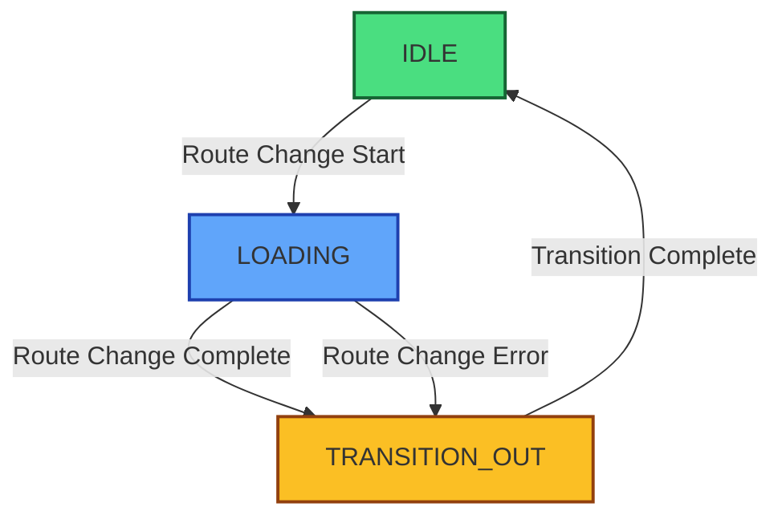
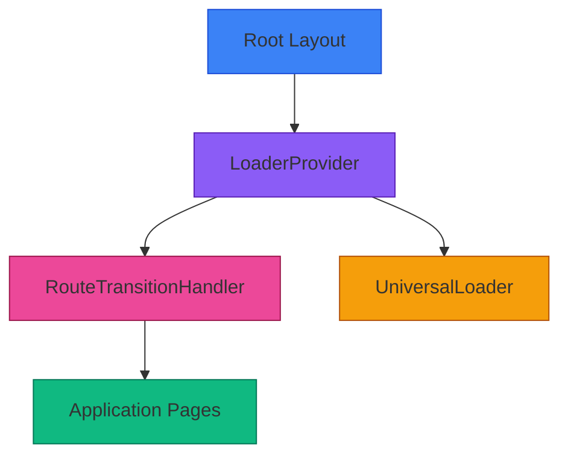
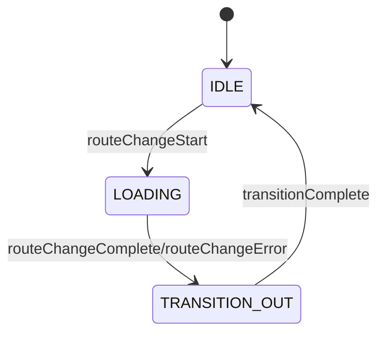

# Transition Flow Diagram

## Event Flow

1. **routeChangeStart** → Show loader immediately
2. **routeChangeComplete** → Wait 300ms, then hide loader
3. **routeChangeError** → Hide loader immediately

## Hydration Safety

- All animated elements use predefined positions
- No random value generation during render
- SSR and CSR render identical markup
- Deterministic animations for consistent experience

## Component Hierarchy

## State Machine

